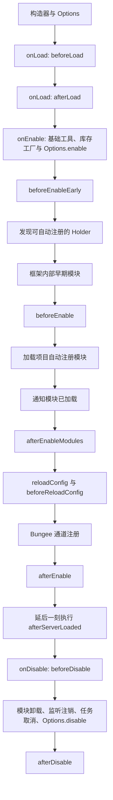

# 主类、Options 与生命周期

插件主类继承 `top.mrxiaom.pluginbase.BukkitPlugin`。PluginBase 已接管 Bukkit 的 `onLoad()`、`onEnable()` 与 `onDisable()`，项目代码只能使用框架公开的扩展点；覆写这三个 Bukkit 回调会绕过或破坏框架流程。

## 主类构造器

主类在构造器中调用 `super(options()...)`，声明框架需要的能力。典型结构：

```java
public final class ExamplePlugin extends BukkitPlugin {
    public ExamplePlugin() throws Exception {
        super(options()
                .bungee(false)
                .adventure(true)
                .database(false)
                .reconnectDatabaseWhenReloadConfig(false)
                .scanIgnore("example.package.libs")
        );
    }
}
```

仅启用真实需要的选项。Options 不是装饰性配置：例如数据库、Bungee 通道、经济和动态库加载会改变框架的初始化、关闭和错误处理路径。

## 重要 Options

| 选项 | 用途 | 使用注意 |
| --- | --- | --- |
| `bungee(boolean)` | 启用 BungeeCord 插件消息通道 | 同时确保包含支持该能力所需模块；框架无法加载接收器时会给出警告。 |
| `database(boolean)` | 初始化数据库 Holder | 启用后按框架约定注册数据库并维护配置。 |
| `reconnectDatabaseWhenReloadConfig(boolean)` | 重载主配置时重连数据库 | 仅在重载策略确实需要时开启。 |
| `economy(...)` | 选择经济接口策略 | Vault 或自定义经济的依赖、缺失处理和兼容性须单独验证。 |
| `adventure(boolean)` | 声明 Adventure 能力 | 依赖处理、消息实现与实际使用须一致。 |
| `libraries(boolean)` | 使用插件数据目录的本地 libraries 加载机制 | 与 resolver/动态库方案一并审查。 |
| `scanPackage(String)` | 指定自动扫描包 | 默认从主类包推导；改变时要避免扩大扫描范围。 |
| `scanIgnore(String...)` | 排除自动扫描包 | 必须包含经 Shadow 重定位的私有库包。 |
| `disableDefaultConfig(boolean)` | 禁用默认 `config.yml` 加载 | 仅由不使用主配置的项目选择。 |
| `enableConfigGotoFlag(boolean)` | 启用 `goto` 配置跳转 | 使用时核对路径和循环跳转边界。 |

公开成员、默认值和设计文档未覆盖的运行差异，必须查询依赖索引返回的实际解析构件资料；不读取或记录 PluginBase 的隐式版本字符串。

## 生命周期顺序

PluginBase 的主流程可以按以下顺序理解：



本文件定义的生命周期顺序可作为常规实现依据。只有当前调用需要精确签名或运行语义、或构建/索引结果与本文冲突时，才查询实际解析构件的最小资料；每个扩展点只做与其阶段相符的工作。

## 生命周期扩展点

| 扩展点 | 调用时机 | 适合做什么 | 不应做什么 |
| --- | --- | --- | --- |
| `beforeLoad()` | Bukkit 加载阶段最早 | 需要在启用前调整第三方库行为的初始化 | 注册依赖完整启用状态的业务功能 |
| `afterLoad()` | `beforeLoad()` 后 | 少量加载阶段收尾 | 覆写原生 `onLoad()` |
| `beforeEnableEarly()` | Options 初始化后、模块发现前 | 检查必要前置条件；返回 `false` 可阻止启用 | 假设自动模块已可用 |
| `beforeEnable()` | 内部早期模块后、项目自动模块前 | 注册项目级基础设施、配置序列化、可选依赖入口 | 使用尚未加载的项目自动模块 |
| `afterEnableModules()` | 项目自动模块加载完成、配置重载前 | 在模块就绪后编排依赖关系 | 假设配置 Holder 已重载 |
| `beforeReloadConfig(FileConfiguration)` | 每次主配置重载时 | 读取主配置、更新配置引用 | 假设所有自定义配置已完成重载 |
| `afterEnable()` | 初次启用的最后阶段 | 启动周期任务、输出完成日志、执行依赖模块已准备好的动作 | 重复注册自动模块或绕开配置重载 |
| `afterServerLoaded()` | `afterEnable()` 后延迟一 tick | 需要服务端启动完成后的工作 | 代替必要的启用阶段初始化 |
| `beforeDisable()` | 卸载的最早阶段 | 取消项目专有任务、保存状态、注销项目资源 | 假设框架尚未处理任何关闭工作 |
| `afterDisable()` | 框架清理之后 | 最终轻量收尾 | 调用已关闭的数据库、调度器或模块 |

## Paper 与 Spigot 兼容的物品/库存工厂

若插件希望**同一 JAR 同时兼容 Spigot 与 Paper**，并使用 PluginBase 的物品编辑或库存创建能力：

1. 加入 `paper` 模块；
2. 在主类覆写 `initItemEditor()` 和 `initInventoryFactory()`；
3. 返回 `PaperFactory.createItemEditor()` 与 `PaperFactory.createInventoryFactory()`；
4. 保持服务器 API 编译基线与项目兼容目标一致，不能因使用该模块就把项目改为 Paper 专用。

`PaperFactory` 会尝试使用 Paper 实现；不可用或检测失败时回退到 Bukkit 兼容实现。它是 PluginBase 提供的运行时兼容层，而不是允许任意 Paper 专用 API 在 Spigot 服务端执行的许可。

示意：

```java
@Override
public @NotNull ItemEditor initItemEditor() {
    return PaperFactory.createItemEditor();
}

@Override
public @NotNull InventoryFactory initInventoryFactory() {
    return PaperFactory.createInventoryFactory();
}
```

所需导入、模块版本和其它 Paper API 的可用性仍需以目标资料为准。

## 主类的禁止事项

- 不覆写 `onLoad()`、`onEnable()`、`onDisable()`；
- 不跳过 Options 直接手动复制框架数据库、类加载器或调度器实现；
- 不在构造器执行依赖模块、配置或插件管理器已就绪后才允许的业务操作；
- 不将所有命令、监听器和业务状态塞入主类；
- 不省略 `scanIgnore` 中的 Shadow 私有库包；
- 不因捕获宽泛异常而忽略框架或可选依赖加载失败。
