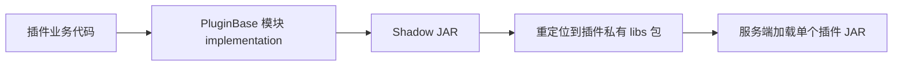

# PluginBase 概览与使用边界

`PluginBase` 是本项目的嵌入式插件开发框架。它不是要求服务器额外安装的前置插件：每个使用它的插件都将所需模块打入自身 JAR，并重定位到该插件的私有包。

本文件仅说明稳定的使用边界。准确的模块版本、公开类型和成员签名必须由目标项目锁定的 PluginBase 版本资料证明，不能以本文或其它项目的旧代码替代查询。

## 核心定位

PluginBase 提供：

- `BukkitPlugin` 主类和插件生命周期扩展点；
- `OptionsBuilder`，用于声明 BungeeCord、Adventure、数据库、经济、动态库、配置等项目能力；
- 插件模块与 `@AutoRegister` 自动加载机制；
- 兼顾 Bukkit、Paper 和 Folia 差异的调度、物品栏、物品编辑等抽象；
- 语言、GUI、Action、命令参数、临时数据、配置、数据库和杂项工具模块；
- 通过 `LibraryHelper`、LibrariesResolver 和 Shadow 的构建/依赖支持。

PluginBase 是项目规范的一部分。使用它已有能力时，应优先按框架生命周期和抽象设计，而不是新建重复的全局单例、扫描器、调度包装或类加载器逻辑。

## 依赖与打包模型

必须满足：

1. 所需 PluginBase 模块以 `implementation` 方式进入运行时类路径；
2. Shadow JAR 包含这些模块；
3. `top.mrxiaom.pluginbase` 被重定位到插件私有 `shadowGroup`；
4. `scanIgnore` 忽略该私有库包，防止框架扫描嵌入依赖；
5. 需要自动注册时合并 `META-INF/PluginBaseHolders`；
6. 服务器 API 保持 `compileOnly`，不作为私有依赖打入 JAR。

若未重定位，`BukkitPlugin` 会检测到这一状态并拒绝正常启动。这是框架主动防止多插件类冲突的机制，不得绕过。

## 模块选择原则

模板的常见基线为 `library` 与 `misc`。只加入实际需要的模块，避免为了“可能有用”扩大 JAR、类扫描和依赖面。

| 模块 | 功能方向 | 选择原则 |
| --- | --- | --- |
| `library` | 主类、基础 API、通用数据/工具、Bukkit 默认实现 | 基线必需 |
| `misc` | 调度、Bungee 通道、配置更新等扩展 | 基线常用；按实际功能核验 |
| `paper` | 运行时探测并在 Paper 实现与 Bukkit 兼容实现间回退的物品/库存工厂 | 插件要同时兼容 Spigot 与 Paper，且使用框架物品编辑或库存创建能力时 |
| `actions` | 配置动作提供器与内建动作 | 使用 Action 系统时 |
| `gui` | GUI 管理、模型和图标等 | 使用框架 GUI 时 |
| `l10n` | 语言管理、消息 Holder | 使用本地化消息时 |
| `commands` | 命令参数与注入工具 | 使用对应命令能力时 |
| `temporary-data` | 临时数据能力 | 需要时 |
| `magic` | Magic 模块能力 | 仅在资料验证后需要时 |
| `config` | 自定义配置实现 | 仅由项目/依赖确实使用时 |

`library`、`misc` 等名称并不等于可随意调用其中任意类。每次引用成员仍须查询目标 PluginBase 版本的源码或 Javadoc。

## 主类职责

项目主类通常：

- 继承 `BukkitPlugin`；
- 在构造器通过 `options()` 声明基础能力；
- 只做项目级初始化、框架扩展点覆盖和少量跨模块注册；
- 提供经验证的项目实例访问方法；
- 不承载具体命令解析、GUI 细节、业务规则或大规模外部插件适配。

生命周期、Options 与禁用的 Bukkit 回调详见 `lifecycle-and-main-class.md`。

## 模块化职责

项目中的功能单元应使用本项目 `func/AbstractModule` 或 `func/AbstractPluginHolder` 作为类型适配层，再继承对应 PluginBase 基类。这样能使构造器中的项目主类类型明确，并让自动注册机制正确发现模块。

自动注册不是无条件扫描一切 class：框架仅处理满足 Holder 继承关系且标有 `@AutoRegister` 的项目类；被重定位依赖由 `scanIgnore` 排除。详见 `auto-register-and-holders.md`。

## 跨服务端和版本兼容

- 默认使用 `BukkitPlugin` 提供的抽象和 `getScheduler()`，不要直接假设 Bukkit 调度模型在 Folia 上安全。
- 需要同时兼容 Spigot 与 Paper 时，引入 `paper` 模块，并在主类覆写 `initItemEditor()` 与 `initInventoryFactory()`，调用已验证的 `PaperFactory`。该工厂会优先尝试 Paper 实现，运行时不可用时回退至 Bukkit 兼容实现，因此这不是“仅 Paper 项目”的模块。
- Adventure、数据库、Bungee 通道与动态库是 Options 和模块共同决定的能力；只打开实际使用的选项。
- API/版本差异的最终判断在 `server-api/` 文档和目标资料中完成，不由框架名称推断。

## 相关文档

- `lifecycle-and-main-class.md`
- `modules-and-capabilities.md`
- `auto-register-and-holders.md`
- `configuration-database-and-libraries.md`
- `concurrency-and-folia.md`
- `packaging-and-relocation.md`
